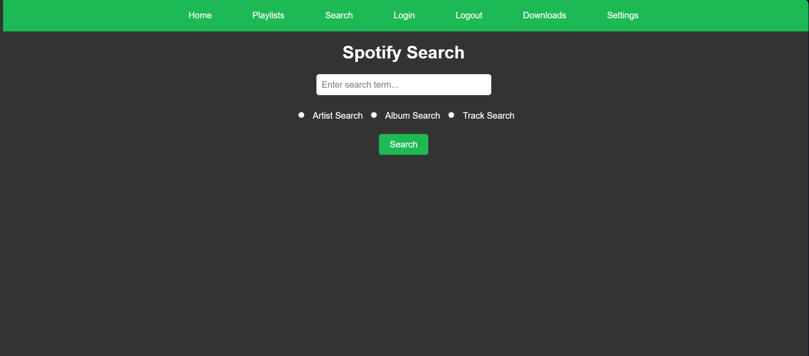

# Soulify


## Overview

Soulify is a hybrid web application that bridges the gap between Spotify and Soulseek, allowing users to search for and download their favorite tracks directly from the Soulseek network.

---

## Features

- **Spotify Integration**: Search for tracks, albums, and playlists directly from Spotify.
- **Soulseek Integration**: Download tracks and albums from Soulseek based on your Spotify searches.
- **Queue Downloads**: Manage multiple downloads with the built-in queueing system.
- **Post-Download Processing**: Automate metadata updates and organize your music library.

---

## Screenshots

### Home Page


### Settings Page


### Download Managment


### Search Page


### Track Search Results


### Album Search Results


### Artist Search Results


### Download Entire Playlists


### Download Individual Playlist Tracks


### Track Search Results

---

## Installation

1. Clone the repository:
    ```bash
    git clone https://github.com/WB2024/soulify.git
    ```
   
2. Navigate to the project directory:
    ```bash
    cd soulify
    ```

3. Install dependencies:
    ```bash
    pip install -r requirements.txt
    ```
4. Download the sldl file from https://github.com/fiso64/slsk-batchdl/releases and place it in the root of the folder. 


5. Create a Spotify Developer Account and Create a new Application:
    - Make a note of the applications Client Id and secret.
	
6. Update your settings:
    - Update `sldl.conf` with your spotify application credentials credentials and settings (ensure that the redirect url matches the callback url in the developer page in spotify) - you can update these settings in the ui later.

7. Run the application:
    ```bash
    python SpotWebApp.py
    ```
---

## Usage

1. **Log in**: Use your Spotify credentials to log in and gain access to your playlists, albums, and tracks.
2. **Search**: Enter search terms to find specific tracks, albums, or artists from Spotify.
3. **Download**: Select the tracks you want and queue them for download from Soulseek.

---

## Legal Disclaimer

This software is intended solely for personal use, and it is your responsibility to ensure that you are in compliance with all applicable copyright laws. The developer of this application does **not** endorse or condone any misuse of this software for piracy or the illegal acquisition of copyrighted material.

**By using this application, you agree to the following:**

- You own the content you download, or have been given permission to download it.
- You will not use this application to illegally obtain music or other media.
- The developer is not responsible for any misuse of this software.

---

## License

[MIT License](LICENSE)
